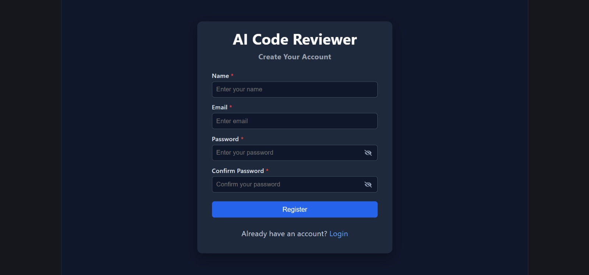
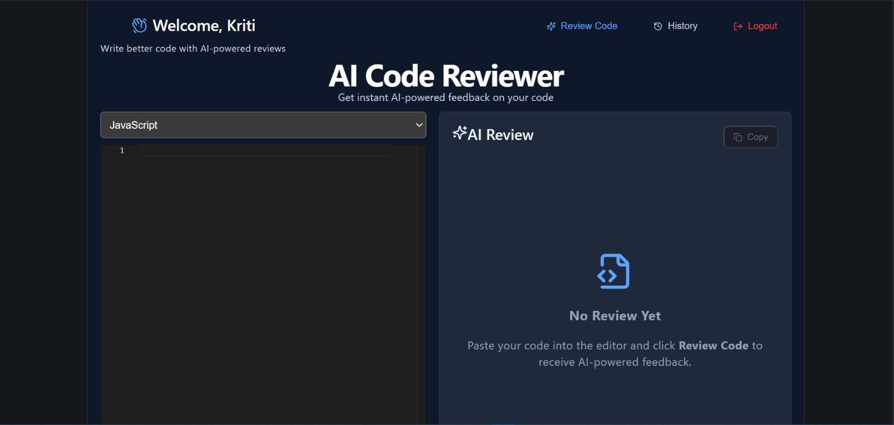
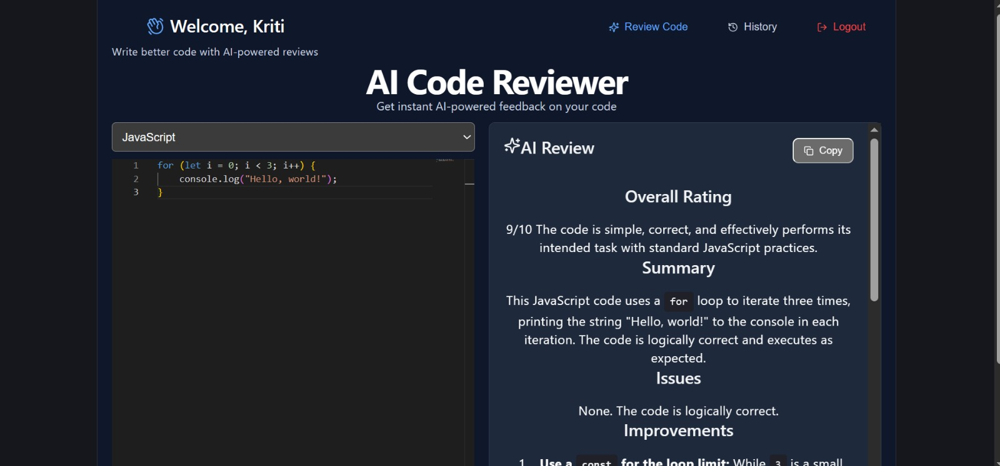
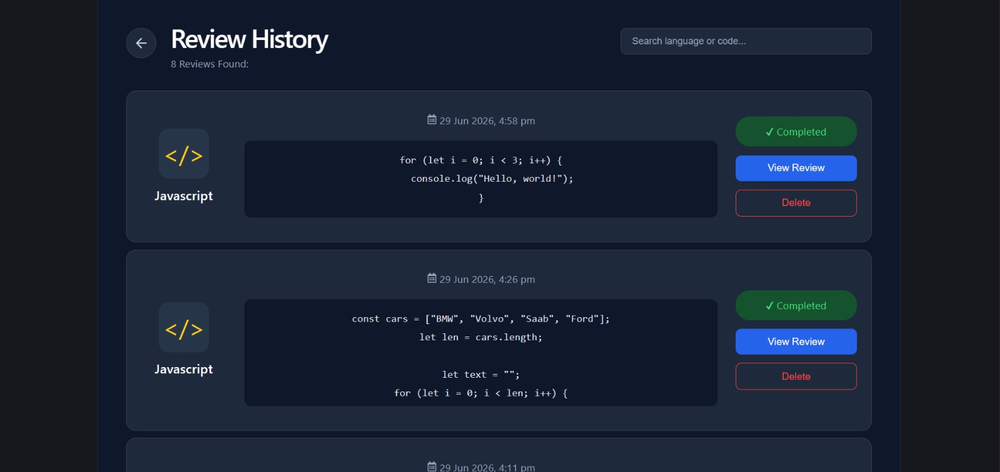

# 🤖 AI Code Reviewer

An AI-powered Code Review application built using the **MERN Stack** and **Google Gemini API**. It helps developers analyze code, identify issues, receive improvement suggestions and generate optimized code with AI.

---

## 🚀 Features

### 🔐 Authentication
- User Registration
- User Login
- JWT Authentication
- Forgot Password
- Reset Password
- Protected Routes

### 🤖 AI Code Review
- AI-powered code review using Google Gemini API
- Overall Rating
- Summary
- Issues Detection
- Improvement Suggestions
- Best Practices
- Time & Space Complexity Analysis
- Optimized Code
- Final Verdict
- Markdown Rendering
- Syntax Highlighting
- Copy Review

### 📜 Review History
- Save review history
- Search reviews
- Delete review
- Pagination
- Review Modal

### 🎨 User Interface
- Modern Dashboard
- Responsive Design
- Monaco Code Editor
- Dark Theme
- Toast Notifications
- Loading States

---

## 🛠️ Tech Stack

### Frontend
- React.js
- Vite
- React Router DOM
- Axios
- Monaco Editor
- React Markdown
- React Syntax Highlighter
- React Icons
- React Toastify

### Backend
- Node.js
- Express.js
- MongoDB
- Mongoose
- JWT Authentication
- Nodemailer
- Google Gemini API

---

## 📂 Project Structure

```text
AI-Code_Reviewer/
├── client/
├── server/
├── screenshots/
├── README.md
└── .gitignore
```

---

## ⚙️ Installation

### Clone Repository

```bash
git clone https://github.com/ishayashika/ai-code-reviewer.git
```

### Backend

```bash
cd server
npm install
npm run dev
```

### Frontend

```bash
cd client
npm install
npm run dev
```

---

## 🔑 Environment Variables

Create a `.env` file inside the **server** folder.

```env
PORT=
MONGO_URI=
JWT_SECRET=
EMAIL_USER=
EMAIL_PASS=
GEMINI_API_KEY=
```

---

## 📸 Screenshots

### Login Page


---

### Register Page



---

### Dashboard



---

### AI Review



---

### Review History



---


## 👨‍💻 Author

**Yashika**

GitHub: https://github.com/ishayashika